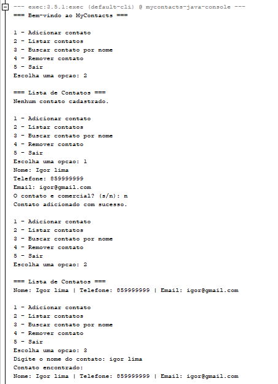
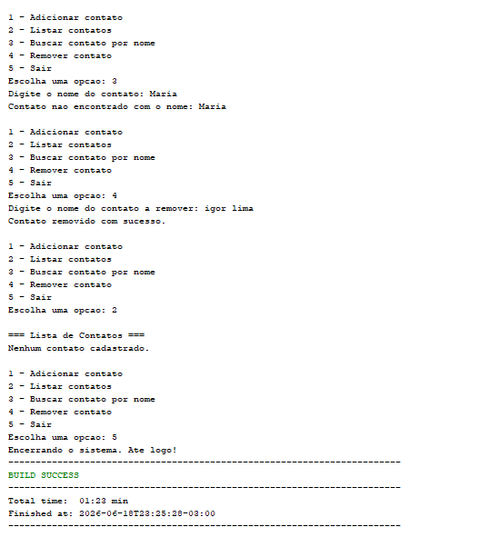

# MyContacts - Agenda de Contatos

Projeto desenvolvido para a atividade de Desenvolvimento de Projeto em Java.

O objetivo da atividade é criar uma aplicação simples em Java, executada pelo console, aplicando conceitos básicos de programação e Programação Orientada a Objetos.

## Demonstração

